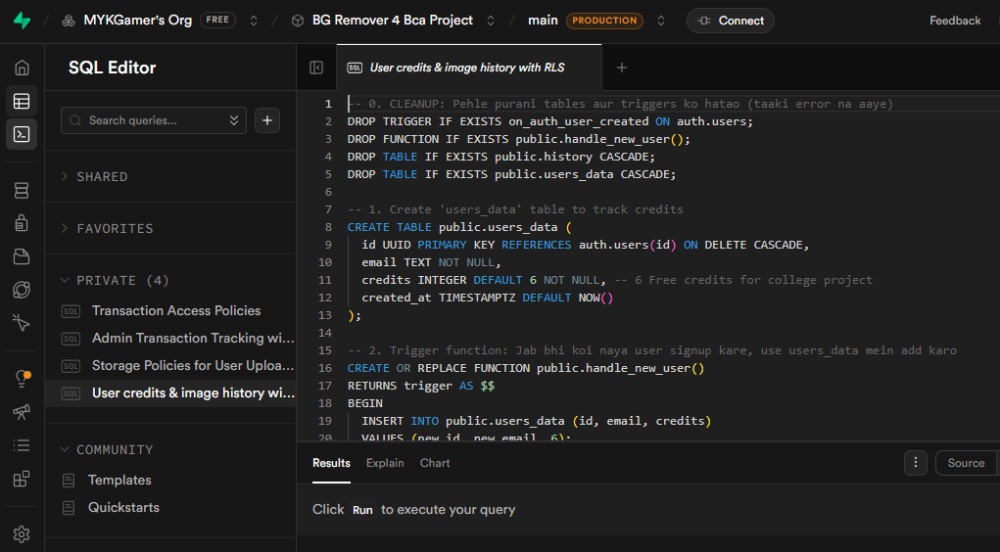

# **"SaaS-Based Background Image Remover System using Next.js and Supabase"**

**Final Project**

**Dharmanand Uniyal Government Degree College, Narendra Nagar**

*Submitted in partial fulfillment of the*
*requirement for the award of the*
*Degree of*

**Bachelor of Computer Applications**

*by*

**MAYANK POKHRIYAL**  
**Roll No:** 4231615220024  
**Enrol. No.:** SV23124089  
**BCA 3rd Year (VI Sem)**  
**Session: 2023-2026**  

*Under the Guidance of*

**Prof. Devendra Kumar**

***

***

**KAANDA-MAI-DAUR, PTC Road, Narendra Nagar (Tehri Garhwal),**
**Uttarakhand-249175.**

**MAY 2026**

# **CERTIFICATE**

This is to certify that the Final Project work titled **“SaaS-Based Background Image Remover System using Next.js and Supabase”**, being submitted by **MAYANK POKHRIYAL**, is submitted in partial fulfillment of the requirements for the award of the Bachelor of Computer Applications degree.

This project is a record of bona-fide work carried out under my guidance. The contents of this project report, in full or in part, have not been copied from any other source nor submitted to any other institute or university for the award of any degree or diploma.

<br><br><br>
Prof. Devendra Kumar  
Project Guide  

<br><br>
The thesis is satisfactory / unsatisfactory
<br><br><br><br>

| | |
| :--- | :--- |
| Internal Examiner1 &nbsp;&nbsp;&nbsp;&nbsp;&nbsp;&nbsp;&nbsp;&nbsp;&nbsp;&nbsp;&nbsp;&nbsp;&nbsp;&nbsp;&nbsp;&nbsp;&nbsp;&nbsp;&nbsp;&nbsp;&nbsp;&nbsp;&nbsp;&nbsp;&nbsp;&nbsp;&nbsp;&nbsp;&nbsp;&nbsp;&nbsp;&nbsp;&nbsp;&nbsp;&nbsp;&nbsp;&nbsp;&nbsp;&nbsp;&nbsp;&nbsp;&nbsp;&nbsp;&nbsp;&nbsp;&nbsp;&nbsp;&nbsp; | Internal Examiner2 |

<br><br><br>
Approved by  
Head of Department  
Department of Computer Applications

# **DECLARATION**

I, **MAYANK POKHRIYAL**, student of BCA (Final Year), hereby declare that the project report entitled **"SaaS-Based Background Image Remover System using Next.js and Supabase"** submitted to the Department of Computer Applications, **Dharmanand Uniyal Government Degree College, Narendra Nagar**, is an original and independent work carried out by me.

I further declare that:

- This project is my own work and has not been submitted, either in part
  or full, for any other degree or diploma at this or any other
  University.

- All references to other sources have been duly acknowledged.

- The project was developed under the supervision of **Prof. Devendra Kumar**.

<br><br><br><br>
(Signature of Student)  

**MAYANK POKHRIYAL**  
**Roll No:** 4231615220024  
**Enrol. No.:** SV23124089  
**BCA 3rd Year (VI Sem)**  
**Session: 2023-2026**  

Date: \_\_\_\_\_\_\_\_\_\_\_\_\_\_\_\_\_\_

# **ACKNOWLEDGEMENT**

I would like to express my heartfelt gratitude to all those who supported and guided me throughout the completion of my final project titled **“SaaS-Based Background Image Remover System using Next.js and Supabase”**.

First and foremost, I am deeply thankful to **Prof. Devendra Kumar**, my project guide, for his invaluable mentorship, constant encouragement, and insightful feedback throughout the duration of this project. His guidance played a vital role in shaping my ideas and helping me bring this project to life.

I am also grateful to the **Department of Computer Applications, Dharmanand Uniyal Government Degree College, Narendra Nagar**, for providing me with the necessary resources and a supportive environment to carry out my work efficiently.

My sincere appreciation goes to all faculty members and staff who offered their assistance and support whenever needed.

Last but not least, I would like to extend my deepest thanks to my family and friends for their continuous motivation, patience, and belief in me throughout this journey.

<br><br><br><br>
(Signature of Student)  

**MAYANK POKHRIYAL**  
**BCA 3rd Year (VI Sem)**  

# **ABSTRACT**

The main goal of this project is to create a web application that automatically removes the background from images. While making graphics for college events, I realized that manual background removal using software like Photoshop takes too much time and requires skills that many people don't have. 

To solve this, I developed a **Software as a Service (SaaS)** solution that uses Artificial Intelligence to do this work automatically in seconds. The website is built using **Next.js** for a fast frontend, **Supabase** for secure user login and database management, and the **Clipdrop API** as the actual AI brain that processes the images.

### **Key Functionalities Implemented:**

- **Secure Authentication:** Email/password-based login and session
  management via Supabase Auth, with server-side route protection using
  Next.js Middleware.

- **AI Processing Engine:** Images are uploaded, sent to the Clipdrop
  API from the server side, and the resulting transparent PNG is
  returned and stored in cloud storage.

- **Credit-Based Usage Model:** Users receive 6 free credits on
  registration; each processing job deducts one credit. Credits can be
  replenished via payment.

- **History Dashboard:** A persistent record of all processed images,
  with rename, download, and delete capabilities.

- **Payment Gateway Integration:** Razorpay integration for secure
  credit top-ups, including server-side HMAC signature verification.

### **Technology Stack:**

- **Frontend & Backend:** Next.js 16.2.4 (App Router, API Routes),
  TypeScript

- **Styling:** Tailwind CSS, Shadcn UI

- **Database, Auth & Storage:** Supabase (PostgreSQL + Supabase Storage)

- **AI Engine:** Clipdrop Remove Background API

- **Payment Gateway:** Razorpay

The successful completion of this project helped me understand how modern web frameworks, external AI APIs, and cloud databases work together to build a real-world SaaS product.

**Keywords:** *Background Removal, SaaS,
Next.js, Supabase, Razorpay, Web Application, Cloud Computing,
PostgreSQL.*

# **TABLE OF CONTENTS**

| **S.No** | **Chapter / Section**                        | **Page No** |
|----------|----------------------------------------------|-------------|
| —        | Certificate                                  | 2           |
| —        | Declaration                                  | 3           |
| —        | Acknowledgement                              | 4           |
| —        | Abstract                                     | 5           |
| —        | List of Figures                              | 6           |
| —        | List of Tables                               | 6           |
| **1**    | **Project Introduction**                     | 7           |
| **2**    | **Technology Stack**                         | 11          |
| **3**    | **System Requirement Specification (SRS)**   | 12          |
| **4**    | **System Architecture & Data Flow**          | 13          |
| **5**    | **Module Descriptions**                      | 14          |
| **6**    | **UI Documentation — Landing Page**          | 16          |
| **7**    | **UI Documentation — Authentication**        | 17          |
| **8**    | **UI Documentation — Dashboard & Sidebar**   | 18          |
| **9**    | **UI Documentation — AI Background Editor**  | 19          |
| **10**   | **UI Documentation — History Management**    | 21          |
| **11**   | **UI Documentation — Settings & Profile**    | 22          |
| **12**   | **UI Documentation — Pricing & Payment System** | 23          |
| **13**   | **Database Design & Data Dictionary**        | 25          |
| **14**   | **Software Testing**                         | 27          |
| **15**   | **Results & Output**                         | 29          |
| **16**   | **Conclusion & Future Scope**                | 30          |
| —        | References                                   | 31          |
| —        | Appendix: Technical Details (Viva Prep)      | 32          |

# **LIST OF FIGURES**

| **Figure No** | **Description**                       | **Page No** |
|---------------|---------------------------------------|-------------|
| Figure 1      | System Architecture & Data Flow       | —           |
| Figure 2      | Landing Page — Full View              | —           |
| Figure 3      | Authentication — Login / Sign Up Page | —           |
| Figure 3B     | Supabase Auth Dashboard — Registered Users List | — |
| Figure 4      | Dashboard — Desktop View with Sidebar | —           |
| Figure 5      | Dashboard — Mobile Responsive View    | —           |
| Figure 6      | AI Background Editor — Upload Zone    | —           |
| Figure 7      | AI Background Editor — Result Preview | —           |
| Figure 8      | History Dashboard — Image Grid        | —           |
| Figure 9      | Settings — Profile & Account Panel    | —           |
| Figure 10     | Pricing Page — Credit Plans           | —           |
| Figure 11     | Razorpay Checkout Modal               | —           |
| Figure 12     | Entity Relationship (ER) Diagram      | —           |
| Figure 12B    | Supabase SQL Editor — Database Schema Implementation | — |

---

# **LIST OF TABLES**

| **Table No** | **Description** | **Page No** |
| :--- | :--- | :--- |
| Table 1 | Software Requirements & Tech Stack | — |
| Table 2 | Software Requirements (Environment) | — |
| Table 3 | Hardware Specifications | — |
| Table 3B | End-User Specifications | — |
| Table 3.5 | Step-by-Step Data Flow Pipeline | — |
| Table 4 | Project Module Descriptions | — |
| Table 4.5 | Authentication Implementation Details | — |
| Table 4.8 | Image Processing Workflow Steps | — |
| Table 4.9 | History Dashboard Implementation Details | — |
| Table 4.10 | Razorpay Sandbox Payment Pipeline | — |
| Table 5 | users_data (User Profile & Credits) | — |
| Table 6 | history (Image Processing Records) | — |
| Table 6B | transactions (Payment & Transaction Records) | — |
| Table 7 | Functional Test Cases & Results | — |
| Table 7B | Completed Test Suites Summary | — |
| Table 7.5 | Feature Implementation Checklist | — |

---

# **CHAPTER 1: PROJECT INTRODUCTION**

## **1.1 Background**

Image editing is a very common requirement for content creators, students, and businesses. One of the most common and difficult tasks is **manually removing backgrounds** from images, especially those with complex edges like hair and fur. Traditionally, this required expensive software like Adobe Photoshop and professional editing skills. With modern web APIs and AI, automated background removal has become a simple and fast utility that can be used directly over the web.

## **1.2 Problem Statement**

Traditional manual background removal has several limitations:
- **Time-consuming:** Manually selecting edges can take 5 to 15 minutes per image, which is very slow.
- **Difficult to Use:** Operating professional editing software requires training and experience.
- **Expensive:** Premium editing software subscriptions are not budget-friendly for small businesses or students.
- **Watermarks and Quality Loss:** Many free online tools reduce the image quality or add watermarks unless the user pays immediately.
- **Lack of Scalability:** Processing many product photos manually creates a bottleneck for e-commerce sellers.

Therefore, there is a clear need for an automated, fast, and accessible web-based solution.

## **1.3 Proposed Solution**

To solve these problems, I developed a simple **AI-powered background remover web application**. A user can log in, upload an image, and the system automatically removes the background in a few seconds using the Clipdrop API. The application provides a high-quality transparent PNG output without requiring manual editing.

## **1.4 What is SaaS?**

**Software as a Service (SaaS)** is a software delivery model where the application is hosted in the cloud and accessed over the internet, so users do not need to install anything on their devices.

This project implements a basic SaaS model through:
- **User Accounts:** Secure registration, login, and personal creations history.
- **Credit System:** A system where users get credits to process images, which can be replenished.
- **Cloud Infrastructure:** Hosted on Vercel (frontend) and Supabase Cloud (database and storage).

## **1.5 Project Objectives**

The main objectives of this project are:
1. To build a secure and fast web application for automated AI background removal.
2. To use a cloud database (Supabase/PostgreSQL) and object storage for managing user profiles, credits, and history.
3. To implement a secure credits purchase system using the Razorpay payment gateway in Sandbox mode.
4. To design a responsive user interface that works on phones, tablets, and laptops.
5. To secure all API keys and database credentials on the server side.

## **1.6 Scope of the Project**

**In Scope:**
- Secure user signup, login, and logout via Supabase Auth.
- Background removal for standard image formats (JPG, PNG, WEBP) up to 4MB.
- Cloud storage of uploaded and processed images in Supabase Storage.
- Credit-based usage and online payments via Razorpay (Sandbox Mode).
- History page to view, rename, download, and delete past creations.

**Out of Scope:**
- Background removal for video files.
- Native mobile applications for app stores.
- Public developer APIs for external integrations.

## **1.7 Feasibility Study**

### **1.7.1 Technical Feasibility**
The stack is built on Next.js and Supabase, which are reliable and easy to integrate. Instead of training a complex computer vision model from scratch—which requires high-end hardware—I integrated the Clipdrop AI API. This ensures high-quality results while keeping the project manageable for a single developer.

### **1.7.2 Economic Feasibility**
Developing this project did not require capital budget. I used the free tiers of Vercel and Supabase. The credit-based model also shows how the application can easily cover its cost if launched commercially.

### **1.7.3 Operational Feasibility**
The user interface is very simple, featuring a drag-and-drop upload zone and clear buttons. Anyone who knows how to upload a file on social media can easily use this tool.

## **1.8 SDLC Methodology**

I followed the **Iterative Development Model** to build, test, and refine the application incrementally:
1. **Requirements:** Defining the features, layout, and database tables.
2. **Development:** Implementing features one by one (Authentication first, then Upload zone, AI endpoint, and finally Payments).
3. **Testing:** Running tests at the end of each iteration to find and fix bugs.
4. **Deployment:** Hosting the live app on Vercel for continuous evaluation.

---

# **CHAPTER 2: TECHNOLOGY STACK**

The project is built using a modern full-stack architecture, focusing on high performance, secure session management, and developer efficiency.

***Table 1: Software Requirements & Tech Stack***
| **Technology** | **Role** | **Purpose** |
| :--- | :--- | :--- |
| **Next.js 16.2.4** | Framework | Core full-stack framework (App Router) for React. Provides server-side rendering (SSR), optimized assets, and API routes. |
| **TypeScript** | Language | Statically typed superset of JavaScript, preventing runtime errors and improving code reliability. |
| **Tailwind CSS** | Styling | Utility-first CSS framework for rapid, clean, and highly responsive user interface design. |
| **Shadcn UI** | UI Components | Accessible, premium pre-built components (buttons, sheets, dialogue modals, and toast alerts). |
| **Supabase** | Backend / DB | Cloud-native platform managing PostgreSQL database schema, user authentication, and S3-compatible cloud storage buckets. |
| **Clipdrop API** | AI Engine | External deep-learning inference API that processes images to perform background segmentation. |
| **Razorpay** | Payments | Secure online payment gateway for UPI, credit/debit cards, and netbanking, operating in Sandbox mode. |
| **Lucide React** | Icons | Modern, lightweight vector icon library providing consistent iconography across the application. |

## **Why This Stack?**
- **Good Performance:** Next.js provides server-side rendering (SSR) and assets optimization, resulting in very fast page load times.
- **Scalability:** Supabase uses PostgreSQL, which easily handles relational queries and database scaling as user traffic grows.
- **Secure Sessions:** Supabase Auth manages user credentials using JWTs in secure cookies. All API keys remain on the server, completely hidden from the browser.
- **Consistent Design:** Combining Tailwind CSS with Shadcn UI helps build a clean dark theme, responsive layouts, and smooth animations easily.

---

# **CHAPTER 3: SYSTEM REQUIREMENT SPECIFICATION (SRS)**

Defining the precise hardware and software specifications is essential. Since this background remover is a cloud-based web application, the heavy computing (AI processing and database) is handled in the cloud. This makes the end-user requirements very lightweight.

## **3.1 Software Requirements (Development Environment)**

***Table 2: Software Requirements (Environment)***
| **Requirement** | **Specification** |
| :--- | :--- |
| **Operating System** | Windows 10 / 11, macOS, or Linux |
| **Programming Language** | TypeScript, JavaScript (ES6+) |
| **Framework** | Next.js 16.2.4 (App Router), React.js |
| **Database** | PostgreSQL (Managed remotely via Supabase) |
| **Code Editor** | Visual Studio Code (VS Code) |
| **Version Control** | Git & GitHub for repository management |
| **Package Manager** | Node.js (v18.x or higher) & npm (v9.x or higher) |
| **API Testing Tool** | Postman (for validating API route endpoints) |

## **3.2 Hardware Requirements (Development Environment)**

***Table 3: Hardware Specifications***
| **Component** | **Minimum Specification** |
| :--- | :--- |
| **Processor** | Intel Core i3 (10th Gen) / AMD Ryzen 3 or higher |
| **Memory (RAM)** | 8 GB minimum (16 GB recommended for Next.js build compilation) |
| **Storage** | 256 GB SSD (with at least 5 GB free disk space) |
| **Network Connectivity** | Stable, active internet connection (required to sync with Supabase and Clipdrop APIs) |

## **3.3 Client / End-User Requirements**

Because the application is cloud-hosted and rendered entirely within the browser, the client-side system demands are minimal. Any end-user device capable of loading modern web elements is supported:

***Table 3B: End-User Specifications***
| **Requirement** | **Specification** |
| :--- | :--- |
| **Device** | Any Desktop PC, Laptop, Apple Mac, Tablet, or Smartphone |
| **Web Browser** | Google Chrome, Mozilla Firefox, Apple Safari, or Microsoft Edge (latest versions) |
| **Network** | Active internet connection for uploading high-resolution images and navigating the dashboard |
| **Storage** | Minimal local storage, required only to save downloaded transparent PNG outputs |

---

# **CHAPTER 4: SYSTEM ARCHITECTURE & DATA FLOW**

The application uses a standard **Client-Server Architecture** built on Next.js. For security reasons, the client browser never communicates directly with third-party APIs (like Clipdrop or Razorpay). All operations—including credit validation, AI processing, database logs, and payment signature verification—are handled securely on the server side via Next.js API Routes.

**Figure 1 below shows how the frontend UI and backend cloud services communicate:**

> **Figure 1: System Architecture & Data Flow**
> 

```
[User Browser (Client)]
          │
          │ Secure HTTPS Requests / Session JWT
          ▼
[Next.js Frontend (Vercel Host)]
          │
          │ Secure Serverless Internal Call
          ▼
[Next.js API Routes (Server Side)]
    ┌─────┴──────────────────┬──────────────────┐
    ▼                        ▼                  ▼
[Supabase Platform]   [Clipdrop API]     [Razorpay Gateway]
- PostgreSQL Database - Stability AI     - Secure Payments
- Auth Service JWT    - Neural Networks  - Sandbox Checkout
- S3 Cloud Storage    - Image Segmentation - HMAC Verifier
```

## **4.1 System Data Flow (Step-by-Step)**

The step-by-step transaction pipeline is detailed in the table below:

***Table 3.5: Step-by-Step Data Flow Pipeline***
| **Step** | **Phase** | **What Happens** |
| :--- | :--- | :--- |
| **1** | **Authentication** | The user logs in via Supabase Auth. Upon validation, a secure JSON Web Token (JWT) session is generated and saved as an HTTP-only cookie in the browser. |
| **2** | **Route Guard** | Next.js Middleware intercepts all dashboard traffic. It checks for a valid session token; if invalid, it performs a server-side redirect to the login portal `/auth`. |
| **3** | **Image Upload** | The authenticated user drops an image in the editor. The client packages the file into a `FormData` object and sends a POST request to `/api/remove-bg`. |
| **4** | **Credit Check** | The server-side API route queries the Supabase database. If `credits < 1`, the process stops immediately with an error response. |
| **5** | **AI Processing** | The server forwards the image to the Clipdrop API using the `CLIPDROP_API_KEY` stored in the server environment variables. |
| **6** | **Cloud Storage** | The transparent PNG result is uploaded to the root of the Supabase Storage bucket (`creations`) with a unique UUID-prefixed filename (e.g., `user_id-timestamp-transparent.png`). |
| **7** | **Database Log** | The server calls the `decrement_credit` PostgreSQL function (via RPC) to subtract 1 credit, and logs the image paths in the `history` table. |
| **8** | **Response Delivery** | The API route returns the public image URL to the client, which then displays the transparent PNG result on screen. |

---

# **CHAPTER 5: MODULE DESCRIPTIONS**

## **5.1 Module Overview**

I divided the application into **7 key modules** to make it modular and easy to manage:

***Table 4: Project Module Descriptions***
| **Module No** | **Module Name** | **Key Objectives & Functional Role** |
| :--- | :--- | :--- |
| **Module 1** | **Landing Page** | Introduces the product, features a dark theme, and prompts users to sign up. |
| **Module 2** | **Login & Security** | Manages user registration, login, JWT cookies, and dashboard route protection. |
| **Module 3** | **AI Editor** | Core client interface with a drag-and-drop area to upload images. |
| **Module 4** | **History Management** | Displays past creations in a grid with rename, download, and delete actions. |
| **Module 5** | **Credit & Payment** | Handles credit plans, Razorpay payments, and server-side verification. |
| **Module 6** | **User Settings** | Displays profile details, credit balance, and secure logout. |
| **Module 7** | **Serverless API** | Securely calls the Clipdrop AI API and handles Supabase database operations. |

---

## **5.2 Technical Specifications of Core Modules**

### **5.2.1 Module 1: Authentication & Route Protection**
**Responsibility:** Handles user login, signup, and dashboard access.
- **Registration Trigger:** When a new user registers, a database trigger automatically sets up their profile with **6 free credits** in the `users_data` table.
- **Route Guard:** Next.js middleware runs on the server, checking for a valid session cookie. If not logged in, users are redirected from `/dashboard` back to the `/auth` page.

### **5.2.2 Module 2: Dashboard Shell & SPA Views**
**Responsibility:** Provides a persistent sidebar and sliding mobile menu for fast navigation.
- **Visual Shell:** Features a static left sidebar for desktop screens and a sliding Hamburger drawer for mobile screens.
- **View Switcher:** Employs a React state (`activeView`) to switch between panels (Editor, History, Pricing) instantly without full page reloads.

### **5.2.3 Module 3: Serverless AI Processing (`/api/remove-bg`)**
**Responsibility:** The core API endpoint that processes the image and manages credits.
- **Credit Check:** The server validates the session and credit balance, aborting the process if the user has 0 credits.
- **AI API Call:** Calls `https://clipdrop-api.co/remove-background/v1` securely from the backend to process the image.
- **Storage & Credits Log:** Uploads the processed image to Supabase Storage and calls a PostgreSQL function (`decrement_credit`) to deduct 1 credit.

### **5.2.4 Module 4: History & Asset Control**
**Responsibility:** Lets users manage their past background removals safely.
- **Row-Level Security (RLS):** Supabase database rules ensure users can only query and edit their own data rows, protecting user privacy.
- **Orphan File Cleanup:** Deleting a history item runs a two-step process: it first deletes the files from Supabase Storage and then removes the database log row to prevent storage clutter.

### **5.2.5 Module 5: Credit Billing & Razorpay Integration**
**Responsibility:** Manages credit packages and Sandbox online payments securely.
- **Secure Order ID:** The client triggers `/api/razorpay/order` to create an order ID server-side, preventing users from tampering with payment amounts.
- **HMAC Signature Check:** Prevents fake payment exploits by calculating and verifying a cryptographic SHA-256 HMAC hash on the server before awarding credits.

---

# **CHAPTER 6: UI DOCUMENTATION — LANDING PAGE**

The Landing Page is the home page of the application. It introduces the project, details its key features, and guides visitors to sign up or log in.

## **6.1 Design Overview**

I designed a dark theme using **Cobalt Blue and Dark Slate** colors. The layout uses modern typography (Inter font), rounded buttons, subtle background glow effects, and smooth transitions to make the site look clean and easy to navigate.

## **6.2 Core Layout Sections**

1. **Navigation Bar:** Contains the logo, pricing anchor link, and login buttons. It is sticky (`backdrop-blur`) so it remains accessible as the user scrolls.
2. **Hero Section:** Features a bold headline, a short subtitle explaining the Clipdrop AI engine, and the main call-to-action (CTA) button.
3. **Features Grid:** Displays the core benefits: processing speed, responsive layout, Supabase cloud backups, and image creations history.
4. **Testimonials & Pricing:** Showcases mock user reviews and credit pricing plans side-by-side.

**Figure 2 shows the full layout of the landing page:**

> **Figure 2: Landing Page — Full View**
> 

## **6.3 Technical Implementation & Design Logic**

### **Dynamic Auth Check**

To improve the user experience, the Landing Page dynamically checks if a user is logged in. If a session exists, the CTA button automatically redirects to the Dashboard instead of forcing them to log in again.

```typescript
// Dynamic Routing Logic for Hero Section CTA
const authRoute = user ? "/dashboard" : "/auth";

<Button asChild className="bg-blue-600 hover:bg-blue-700 text-white font-semibold rounded-lg shadow-lg shadow-blue-500/20 px-8 py-4 transition-all">
  <Link href={authRoute}>Get Started for Free</Link>
</Button>
```

### **Page Layout Design Logic**

The layout is planned to naturally guide visitors toward signing up:
- **Bold Headline:** The hero section uses a large heading to grab attention first.
- **Features Section:** Shows the key benefits (AI speed, cloud saves, history) so visitors understand the tool.
- **Pricing Cards:** Displays the 6 free credits on signup to encourage users to try without hesitation.
- **CTA Buttons:** Placed at both the top navigation and hero center so users can start from anywhere on the page.

---

# **CHAPTER 7: UI DOCUMENTATION — AUTHENTICATION**

Authentication is an essential part of the application. The system implements a secure login and signup mechanism using **Supabase Auth**.

## **7.1 Secure Login & Signup**

The user portal provides a simple interface for email/password validation and Google social login. To keep user accounts secure, I used Supabase Auth, which handles password hashing and secure session tokens.

### **Core Implementation Matrix**

The authentication structure is summarized in the table below:

***Table 4.5: Authentication Implementation Details***
| **Authentication Feature** | **How it Works** |
| :--- | :--- |
| **Email/Password Auth** | Validates email and password using Supabase's `signInWithPassword()` method. |
| **Google OAuth** | Allows single-click login using a Google account to save time. |
| **Session Cookies** | Session tokens are stored in secure cookies to prevent client-side script hacks. |
| **Credit Trigger** | A database function automatically awards 6 free credits on signup. |
| **Form Validation** | Zod schema checks the email format and password length on the frontend. |
| **Route Protection** | Middleware checks session cookies and redirects anonymous users to `/auth`. |

---

### **Technical Implementation — Auth & Route Protection Logic**

Below is the actual operational codebase written for input formatting validation, email auth execution, Google OAuth hooks, and edge middleware route protection:

```typescript
// 1. Zod Schema for Secure Client-Side Form Validation
import { z } from "zod"

const loginSchema = z.object({
  email: z.string().email({ message: "Invalid email address" }),
  password: z.string().min(6, { message: "Password must be at least 6 characters" }),
})

// 2. Server Action for Email and Password Authentication
// File path: /src/app/auth/actions.ts
import { createClient } from '@/utils/supabase/server'
import { revalidatePath } from 'next/cache'
import { redirect } from 'next/navigation'

export async function login(formData: FormData, redirectTo: string = '/dashboard') {
  const supabase = await createClient()

  const data = {
    email: formData.get('email') as string,
    password: formData.get('password') as string,
  }

  const { error } = await supabase.auth.signInWithPassword(data)

  if (error) {
    return { error: error.message }
  }

  revalidatePath('/', 'layout')
  redirect(redirectTo)
}

// 3. Social Login (Google OAuth) Integration
// File path: /src/app/auth/actions.ts
import { headers } from 'next/headers'

export async function loginWithGoogle(next: string = '/dashboard') {
  const supabase = await createClient()
  const origin = (await headers()).get('origin')
  const siteUrl = process.env.NEXT_PUBLIC_SITE_URL || origin

  const { data, error } = await supabase.auth.signInWithOAuth({
    provider: 'google',
    options: {
      redirectTo: `${siteUrl}/auth/callback?next=${encodeURIComponent(next)}`,
    },
  })

  if (error) return { error: error.message }
  if (data.url) redirect(data.url) // Directs client to Google's authentication page
}

// 4. Supabase Session Middleware Helper (@supabase/ssr)
// File path: /src/utils/supabase/middleware.ts
import { createServerClient } from '@supabase/ssr'
import { NextResponse, type NextRequest } from 'next/server'

export async function updateSession(request: NextRequest) {
  let supabaseResponse = NextResponse.next({ request })

  const supabase = createServerClient(
    process.env.NEXT_PUBLIC_SUPABASE_URL!,
    process.env.NEXT_PUBLIC_SUPABASE_ANON_KEY!,
    {
      cookies: {
        getAll() {
          return request.cookies.getAll()
        },
        setAll(cookiesToSet) {
          cookiesToSet.forEach(({ name, value }) => request.cookies.set(name, value))
          supabaseResponse = NextResponse.next({ request })
          cookiesToSet.forEach(({ name, value, options }) =>
            supabaseResponse.cookies.set(name, value, options)
          )
        },
      },
    }
  )

  const { data: { user } } = await supabase.auth.getUser()

  // Checks for active session; redirects unauthenticated visitors to auth
  if (
    !user &&
    !request.nextUrl.pathname.startsWith('/login') &&
    !request.nextUrl.pathname.startsWith('/auth') &&
    !request.nextUrl.pathname.startsWith('/pricing') &&
    request.nextUrl.pathname !== '/'
  ) {
    const url = request.nextUrl.clone()
    url.pathname = '/auth'
    return NextResponse.redirect(url)
  }

  return supabaseResponse
}

// 5. Global Server-Side Route Guard (Next.js Middleware)
// File path: /src/middleware.ts (routed through /src/proxy.ts)
import { type NextRequest } from 'next/server'
import { updateSession } from '@/utils/supabase/middleware'

export async function middleware(request: NextRequest) {
  return await updateSession(request)
}
```

### **Auth Logic Insights:**
- **HTTP-only Cookies:** JWTs are stored in HTTP-only cookies, so browser JavaScript cannot access or tamper with the session token.
- **Server Middleware Guard:** The `updateSession()` function in `middleware.ts` runs on every request to check if a valid session exists. If not, the user is redirected to `/auth` before any page content loads.
- **Auto-Credit on Signup:** A PostgreSQL trigger fires automatically when a new user is inserted into `auth.users`, adding 6 credits to their `users_data` row instantly.

## **7.2 UI Layout Details**

The authentication page is designed to be clean and simple. The login and signup forms are centered on the screen, showing only the necessary input fields to prevent confusion.

**Figure 3 shows the Login and Registration UI panel**, and **Figure 3B displays the backend user database** inside the Supabase cloud dashboard.

> **Figure 3: Authentication — Login / Sign Up Page**
> 

> **Figure 3B: Supabase Auth Dashboard — Registered Users List**
> 

**Design Logic:** By focusing on high-contrast colors (Cobalt and Slate), providing single-click Google login buttons, and integrating real-time error messages, the registration process is kept simple and user-friendly.

---

# **CHAPTER 8: UI DOCUMENTATION — DASHBOARD & SIDEBAR**

The Dashboard is the central control panel for authenticated users. It uses a **Shell Layout** with a collapsible sidebar and state-based page views (SPA pattern) to make navigation instant without page reloads.

## **8.1 Sidebar Navigation**

The navigation uses React state to render views conditionally. This client-side rendering makes view switching fast without page reloads. The sidebar contains:
- **BG Editor:** Drag-and-drop file upload workspace.
- **My Creations:** The history page showing past processed images.
- **Pricing:** The credit plans page.
- **Settings:** Simple account profile sheet.

**Figure 4 shows the desktop view of the dashboard with the sidebar:**

> **Figure 4: Dashboard — Desktop View with Sidebar**
> 

### **React View Switching Codebase**
Below is the core navigation state loop I wrote to drive the dashboard sidebar:

```typescript
// State-Based View Navigation Loop (SPA Pattern)
import React, { useState } from "react"
import { Wand2, History, CreditCard, Settings } from "lucide-react"

type ViewType = 'editor' | 'history' | 'pricing' | 'settings'

export default function DashboardShell() {
  const [activeView, setActiveView] = useState<ViewType>('editor')

  const menuItems = [
    { id: 'editor', label: 'BG Editor', icon: Wand2 },
    { id: 'history', label: 'My Creations', icon: History },
    { id: 'pricing', label: 'Pricing', icon: CreditCard },
    { id: 'settings', label: 'Settings', icon: Settings },
  ]

  return (
    <div className="flex h-screen bg-slate-950 text-slate-100">
      <aside className="w-64 border-r border-slate-800 bg-slate-900 p-4 hidden md:block">
        <nav className="space-y-2">
          {menuItems.map((item) => (
            <button
              key={item.id}
              onClick={() => setActiveView(item.id as ViewType)}
              className={`flex w-full items-center px-4 py-3 rounded-lg text-sm font-medium transition-all ${
                activeView === item.id 
                  ? "bg-blue-600/10 text-blue-500 border-l-2 border-blue-500" 
                  : "text-slate-400 hover:bg-slate-800 hover:text-slate-200"
              }`}
            >
              <item.icon className="h-5 w-5 mr-3" />
              {item.label}
            </button>
          ))}
        </nav>
      </aside>
      
      {/* Content Rendering Zone */}
      <main className="flex-1 overflow-y-auto p-8">
        {activeView === 'editor' && <BgEditor />}
        {activeView === 'history' && <HistoryPanel />}
        {activeView === 'pricing' && <PricingPanel />}
        {activeView === 'settings' && <SettingsPanel />}
      </main>
    </div>
  )
}
```

## **8.2 Responsive Layout Adaptations**

To support mobile devices, the dashboard sidebar is responsive. On desktop screens, it remains visible on the left. On mobile screens (below 768px), the sidebar disappears and is replaced by a sliding menu drawer (Hamburger trigger using Shadcn UI Sheet).

**Figure 5 shows how the dashboard layout adjusts on mobile viewports:**

> **Figure 5: Dashboard — Mobile Responsive View**
>  

**Design Logic:** By organizing the layout logically, displaying the user's remaining credits in the header, and collapsing the sidebar on mobile, the dashboard keeps the editing workspace clean and uncluttered.

---

# **CHAPTER 9: UI DOCUMENTATION — AI BACKGROUND EDITOR**

This is the main workspace of the application where users upload their images and get backgrounds removed.

## **9.1 Simple Upload & Validation**

I created a drag-and-drop upload zone. To prevent errors and unnecessary server load, the frontend checks the file before sending it to the server:
- **File Type:** Only standard image formats (JPG, JPEG, PNG, WEBP) are accepted.
- **File Size:** Uploads are strictly capped at a maximum of **4MB** to ensure fast processing. Files larger than 4MB trigger an immediate error message.

**Figure 6 shows the interactive upload zone interface:**

> **Figure 6: AI Background Editor — Upload Zone**
> 

## **9.2 Processing Workflow**

The table below details the step-by-step image processing pipeline:

***Table 4.8: Image Processing Workflow Steps***
| **Step** | **Action** | **Operational Location** |
| :--- | :--- | :--- |
| **1** | User selects or drops an image (max 4MB). | Client Browser |
| **2** | File format and file size are validated. | Client Browser |
| **3** | Image data is sent as `FormData` to `/api/remove-bg`. | Client → Next.js Server |
| **4** | Server checks user session cookie and credit count. | Next.js Server |
| **5** | Server sends image stream to Clipdrop AI API. | Next.js Server → Clipdrop |
| **6** | Server receives transparent PNG and saves it in Supabase Storage. | Next.js Server → Supabase Storage |
| **7** | Server logs record in database and decrements credit count. | Next.js Server → Supabase Database |
| **8** | Server returns the public image URL, and the client displays it. | Next.js Server → Client Browser |

---

## **9.3 Technical Implementation**

The background removal backend logic runs inside a Next.js API Route. This keeps the **CLIPDROP_API_KEY** safe on the server environment, completely hidden from the client browser. I also added a passcode modal logic (`x-access-code: '2026'`) for the project presentation and a helper to download the file directly.

### **1. Server-Side AI Processing Pipeline (`/api/remove-bg/route.ts`)**
```typescript
import { NextResponse } from 'next/server'
import { createClient } from '@/utils/supabase/server'
import { supabaseAdmin } from '@/utils/supabase/admin'
import { revalidatePath } from 'next/cache'

export async function POST(req: Request) {
  let uploadedOriginalPath = ''
  
  try {
    const formData = await req.formData()
    const file = formData.get('image') as File | null
    const accessCode = req.headers.get('x-access-code')

    // 1. Project Evaluation Security Gatekeeper
    if (accessCode !== '2026') {
      return NextResponse.json({ error: 'Invalid or missing Access Code.' }, { status: 403 })
    }
    
    if (!file) {
      return NextResponse.json({ error: 'No image provided' }, { status: 400 })
    }

    // 2. Client-Side Input File Size Validation (4MB Limit)
    const MAX_FILE_SIZE = 4 * 1024 * 1024 
    if (file.size > MAX_FILE_SIZE) {
      return NextResponse.json({ error: 'Image too large. Max limit is 4MB.' }, { status: 400 })
    }

    const supabase = await createClient()
    const { data: { user } } = await supabase.auth.getUser()

    if (!user) {
      return NextResponse.json({ error: 'Unauthorized' }, { status: 401 })
    }

    // 3. Authenticate User & Validate Credit Balance
    const { data: userData, error: userError } = await supabase
      .from('users_data')
      .select('credits')
      .eq('id', user.id)
      .single()

    if (userError || !userData) {
      return NextResponse.json({ error: 'Could not fetch user data' }, { status: 400 })
    }

    if (userData.credits <= 0) {
      return NextResponse.json({ error: 'Out of credits. Please top up to continue.' }, { status: 400 })
    }

    // 4. Upload Original Image directly to Root S3 Storage
    const fileExt = file.name.split('.').pop()
    const fileName = `${user.id}-${Date.now()}-original.${fileExt}`
    uploadedOriginalPath = fileName

    const { error: uploadError } = await supabase.storage
      .from('creations')
      .upload(fileName, file)

    if (uploadError) {
      return NextResponse.json({ error: 'Failed to upload image to storage' }, { status: 500 })
    }

    const originalUrl = supabase.storage.from('creations').getPublicUrl(fileName).data.publicUrl

    // 5. Send Image to Clipdrop AI API Securely
    const clipdropForm = new FormData()
    clipdropForm.append('image_file', file)

    const response = await fetch('https://clipdrop-api.co/remove-background/v1', {
      method: 'POST',
      headers: {
        'x-api-key': process.env.CLIPDROP_API_KEY!,
      },
      body: clipdropForm,
    })

    if (!response.ok) {
      await supabase.storage.from('creations').remove([fileName])
      return NextResponse.json({ error: 'AI processing failed. Try again later.' }, { status: 500 })
    }

    const buffer = await response.arrayBuffer()
    const resultBlob = new Blob([buffer], { type: 'image/png' })
    const resultFile = new File([resultBlob], 'result.png', { type: 'image/png' })

    // 6. Upload Processed Transparent Image to S3 Storage
    const resultFileName = `${user.id}-${Date.now()}-transparent.png`

    const { error: resultUploadError } = await supabase.storage
      .from('creations')
      .upload(resultFileName, resultFile)

    if (resultUploadError) {
      await supabase.storage.from('creations').remove([fileName])
      return NextResponse.json({ error: 'Failed to save processed image' }, { status: 500 })
    }

    const transparentUrl = supabase.storage.from('creations').getPublicUrl(resultFileName).data.publicUrl

    // 7. Save Creations History Log Row
    const { error: historyError } = await supabase
      .from('history')
      .insert({
        user_id: user.id,
        title: file.name,
        original_image_url: originalUrl,
        transparent_image_url: transparentUrl
      })

    // 8. Atomically Decrement User Credit using Postgres RPC function
    await supabaseAdmin.rpc('decrement_credit', { user_id: user.id })

    revalidatePath('/dashboard')
    return NextResponse.json({ success: true, originalUrl, transparentUrl })

  } catch (error: any) {
    if (uploadedOriginalPath) {
      const supabase = await createClient()
      await supabase.storage.from('creations').remove([uploadedOriginalPath])
    }
    return NextResponse.json({ error: `System Error: ${error?.message}` }, { status: 500 })
  }
}
```

### **2. Client-Side Download Handler Helper**
To download the high-resolution transparent PNG output without forcing the user to right-click and save manually, I wrote a simple helper function that creates a temporary anchor tag in the document body:

```typescript
// Helper function to trigger instant file downloads
const handleDownload = (imageUrl: string, title: string = 'removed-bg.png') => {
  const anchor = document.createElement('a')
  anchor.href = imageUrl
  anchor.download = title
  document.body.appendChild(anchor)
  anchor.click() // Triggers the browser download dialog
  document.body.removeChild(anchor) // Cleans up the DOM element
}
```

---

## **9.4 Processing & Result Preview**

While the AI API processes the image on the server, the frontend shows a "Processing..." spinner so the user knows the request is in progress. Once the server responds, the final transparent PNG is shown next to the original input image.

> **Figure 7: AI Background Editor — Result Preview**
> 

**Design Logic:** The spinner gives the user clear feedback while waiting. Once done, both the original and result images appear side-by-side, with a Download button to save the transparent PNG instantly.

---

# **CHAPTER 10: UI DOCUMENTATION — HISTORY MANAGEMENT**

A key feature of this application is that users do not lose their past creations after closing the browser. All processed images are stored securely in the cloud and remain accessible inside a personal history panel at any time.

## **10.1 Image Grid**

The "My Creations" panel displays all past processed images in a clean, responsive grid layout. Each card shows a thumbnail of the transparent PNG output, the original filename, and the creation date.

### **Creations Panel Implementation Details**

The core CRUD logic for history asset management is mapped in the following implementation table:

***Table 4.9: History Dashboard Implementation Details***
| **Feature** | **Detailed Operational Mechanism** |
| :--- | :--- |
| **Data Fetching** | Queries the Supabase `history` table, filtered by user ID and ordered by creation date (`created_at` descending). |
| **Data Security** | Managed via Supabase Row-Level Security (RLS), ensuring users can strictly select and modify only their own data records. |
| **Asset Renaming** | Triggers an inline update to write a new custom title back to the database history row. |
| **Asset Deletion** | A secure two-step pipeline that clears the media assets from cloud storage first, then deletes the database log record. |

---

## **10.2 Asset Management (CRUD Logic)**

Users have complete control over their creations catalog. The UI supports downloading, renaming, and deleting files. To implement this cleanly, I wrote a React client-side event handler to trigger toast alerts and a Next.js Server Action to perform the actual deletion on the backend:

### **1. React Client-Side Deletion Handler**
```typescript
// Triggers local UI updates and shows toast notifications to the user
const handleDelete = async (itemId: string, originalUrl: string, transparentUrl: string) => {
  try {
    // Invoke the secure Server Action on the backend
    const result = await deleteHistoryItem(itemId, originalUrl, transparentUrl)
    
    if (result.success) {
      toast.success("Image permanently deleted from your creations.")
    } else {
      toast.error("Failed to delete the image.")
    }
  } catch (error) {
    console.error("Deletion error:", error)
    toast.error("Something went wrong during deletion.")
  }
}
```

### **2. Server-Side Deletion Action (`/src/app/dashboard/history-actions.ts`)**
```typescript
'use server'

import { createClient } from '@/utils/supabase/server'
import { revalidatePath } from 'next/cache'

function extractFilenameFromUrl(url: string) {
  // URLs look like: https://[project].supabase.co/storage/v1/object/public/creations/filename.png
  const parts = url.split('/')
  return parts[parts.length - 1]
}

export async function deleteHistoryItem(id: string, originalUrl: string, transparentUrl: string) {
  try {
    const supabase = await createClient()
    const { data: { user } } = await supabase.auth.getUser()

    if (!user) {
      return { error: 'Unauthorized' }
    }

    // Extract filenames from public URLs
    const originalFilename = extractFilenameFromUrl(originalUrl)
    const transparentFilename = extractFilenameFromUrl(transparentUrl)

    // 1. Delete physical files from Supabase Storage FIRST to save space
    const { error: storageError } = await supabase.storage
      .from('creations')
      .remove([originalFilename, transparentFilename])

    if (storageError) {
      console.error('Failed to delete files from storage:', storageError)
      return { error: 'Failed to delete files from storage' }
    }

    // 2. THEN Delete database log metadata from PostgreSQL history table
    const { error: dbError } = await supabase
      .from('history')
      .delete()
      .eq('id', id)
      .eq('user_id', user.id) // Ensure user owns the record

    if (dbError) {
      console.error('Failed to delete history record:', dbError)
      return { error: 'Failed to delete history record' }
    }

    revalidatePath('/dashboard')
    return { success: true }
  } catch (error: unknown) {
    console.error('Server Action Error:', error)
    return { error: error instanceof Error ? error.message : 'An unexpected error occurred' }
  }
}
```

### **Data Integrity & Cleanup Logic:**
- **Two-Step Deletion:** Deleting files from Supabase Storage *before* clearing the database log ensures that if the database write fails, the files are already removed, avoiding orphaned files.
- **Ownership Verification:** Deleting rows using both `id` and `user_id` filters prevents unauthorized deletes.
- **Cache Purge:** Calling `revalidatePath('/dashboard')` updates the Creations grid instantly.

**Figure 8 shows the Creations history page layout:**

> **Figure 8: History Dashboard — Image Grid**
> 

**Design Logic:** The creations grid uses a simple card layout. This makes it easy for users to browse past removals and download, rename, or delete files directly inside each card.

---

# **CHAPTER 11: UI DOCUMENTATION — SETTINGS & PROFILE**

The Settings panel provides a simple interface for users to review their account details and log out safely.

## **11.1 Account Summary & Credit Balance**

The Settings panel displays simple profile details, including the user's logged-in email address and account status. It also shows a prominent **Credit Badge** displaying their remaining credits, which updates in real-time.

## **11.2 Secure Session Management (Sign Out)**

Clicking the Sign Out button safely ends the Supabase session, clearing all authentication cookies from the browser.

**The user settings panel is represented in Figure 9:**

> **Figure 9: Settings — Profile & Account Panel**
> 

### **Secure Logout Client-Side Handler**
```typescript
import { createBrowserClient } from "@supabase/ssr"
import { useRouter } from "next/navigation"

export default function SettingsPanel() {
  const supabase = createBrowserClient(
    process.env.NEXT_PUBLIC_SUPABASE_URL!,
    process.env.NEXT_PUBLIC_SUPABASE_ANON_KEY!
  )
  const router = useRouter()

  const handleLogout = async () => {
    // Ends session on Supabase servers and clears browser cookies
    await supabase.auth.signOut()
    toast.success("Successfully logged out.")
    router.push('/') // Redirects user back to landing page
  }
}
```

**Design Logic:** Grouping related fields together and showing a persistent credit badge in the header ensures users can monitor their balance without leaving the editor canvas.

---

# **CHAPTER 12: UI DOCUMENTATION — PRICING & PAYMENT SYSTEM**

To implement a complete credit replenishment system, I integrated the **Razorpay Payment Gateway** in Sandbox mode.

## **12.1 Credit System Logic**

The application uses a pay-as-you-go credit model:
- **One Removal = One Credit:** Each successful background removal deducts 1 credit.
- **Onboarding Credits:** New users automatically receive **6 free credits** on registration.
- **Credit Top-up:** Users can buy packages (such as 5, 10, or 20 credits) on the Pricing view.

**Figure 10 shows the credit plans layout on the Pricing page:**

> **Figure 10: Pricing Page — Credit Plans**
> 

---

## **12.2 Razorpay Integration (Sandbox Mode)**

The application integrates Razorpay's checkout in **Sandbox Mode**. This lets us test the complete payment loop (cards, netbanking, mock UPI) securely without using real money.

### **Payment Lifecycle**

The step-by-step payment flow is described in the table below:

***Table 4.10: Razorpay Sandbox Payment Pipeline***
| **Step** | **Phase** | **Detailed Pipeline Action** |
| :--- | :--- | :--- |
| **1** | **Selection** | The user clicks a purchase package (e.g., 10 credits) on the Pricing grid. |
| **2** | **Order ID** | The client calls `/api/razorpay/order` server-side to generate a Razorpay order ID. |
| **3** | **Checkout Modal** | The Razorpay SDK opens a checkout dialog box over the dashboard. |
| **4** | **Sandbox Payment** | The user uses sandbox credentials (test card details) to complete the checkout. |
| **5** | **Token Generation** | Razorpay returns `razorpay_order_id`, `razorpay_payment_id`, and `razorpay_signature`. |
| **6** | **Handshake** | The client sends these tokens to `/api/razorpay/verify` on the server. |
| **7** | **HMAC Check** | The server computes an HMAC-SHA256 hash using the private secret key to verify the payment. |
| **8** | **Credit Top-up** | Upon successful verification, credits are added and logged in the database. |

---

## **12.3 Technical Implementation & Secure Billing Routes**

To protect the platform from fraud, order generation and payment verification are executed exclusively on the server side using two Next.js API Routes:

### **1. Server-Side Order Generation Route (`/api/razorpay/order/route.ts`)**
This route communicates server-to-server with Razorpay to issue a secure order ID before checkout, embedding the user ID and credit quantity inside the order metadata to prevent clients from tampering with payment amounts:

```typescript
import { NextResponse } from "next/server";
import Razorpay from "razorpay";
import { createClient } from "@/utils/supabase/server";

const razorpay = new Razorpay({
  key_id: process.env.NEXT_PUBLIC_RAZORPAY_KEY_ID!,
  key_secret: process.env.RAZORPAY_KEY_SECRET!,
});

export async function POST(req: Request) {
  try {
    const { amount, credits } = await req.json();
    const supabase = await createClient();
    const { data: { user } } = await supabase.auth.getUser();

    if (!user) {
      return NextResponse.json({ error: "Unauthorized" }, { status: 401 });
    }

    const options = {
      amount: amount * 100, // Razorpay amount is in paise (1 INR = 100 paise)
      currency: "INR",
      receipt: "receipt_" + Math.random().toString(36).substring(7),
      notes: {
        userId: user.id,   // Embed user ID to allocate credits securely
        credits: credits,  // Embed purchased credits quantity
      }
    };

    const order = await razorpay.orders.create(options);
    return NextResponse.json(order);
  } catch (error) {
    console.error("Razorpay Error:", error);
    return NextResponse.json(
      { error: "Error creating Razorpay order" },
      { status: 500 }
    );
  }
}
```

### **2. Server-Side Signature Verification Route (`/api/razorpay/verify/route.ts`)**
This route mathematically validates the payment signature before adding credits, retrieving the original metadata from Razorpay's server logs to completely block fake client-side transaction requests:

```typescript
import { NextResponse } from "next/server";
import crypto from "crypto";
import Razorpay from "razorpay";
import { createClient } from "@/utils/supabase/server";

const razorpay = new Razorpay({
  key_id: process.env.NEXT_PUBLIC_RAZORPAY_KEY_ID!,
  key_secret: process.env.RAZORPAY_KEY_SECRET!,
});

export async function POST(req: Request) {
  try {
    const { razorpay_order_id, razorpay_payment_id, razorpay_signature } = await req.json();

    const body = razorpay_order_id + "|" + razorpay_payment_id;

    // Generate HMAC-SHA256 signature using my server secret key
    const expectedSignature = crypto
      .createHmac("sha256", process.env.RAZORPAY_KEY_SECRET!)
      .update(body.toString())
      .digest("hex");

    const isAuthentic = expectedSignature === razorpay_signature;

    if (isAuthentic) {
      // 1. Fetch order from Razorpay to retrieve embedded metadata (notes)
      const order = await razorpay.orders.fetch(razorpay_order_id);
      const { userId, credits } = order.notes as any;

      if (userId && credits) {
        const supabase = await createClient();
        
        // 2. Retrieve current credits to prevent client-side overrides
        const { data: currentData } = await supabase
          .from('users_data')
          .select('credits')
          .eq('id', userId)
          .single();
          
        const newCredits = (currentData?.credits || 0) + Number(credits);
        
        // 3. Update user credits securely in users_data
        await supabase
          .from('users_data')
          .update({ credits: newCredits })
          .eq('id', userId);

        // 4. Insert audit log in transactions table
        await supabase
          .from('transactions')
          .insert({
            user_id: userId,
            amount: (order.amount as any) / 100, // Convert from paise to rupees
            credits: Number(credits),
            razorpay_order_id: razorpay_order_id,
            razorpay_payment_id: razorpay_payment_id,
            status: 'success'
          });
      }

      return NextResponse.json({ 
        message: "Payment verified and credits added successfully",
        success: true 
      });
    } else {
      return NextResponse.json({ 
        message: "Payment verification failed",
        success: false 
      }, { status: 400 });
    }
  } catch (error) {
    console.error("Verification Error:", error);
    return NextResponse.json({ error: "Error verifying payment" }, { status: 500 });
  }
}
```

### **Why Signature Verification Matters:**
- **Anti-Fraud Guard:** By comparing the signatures, the server ensures that the payment actually took place on Razorpay's servers. A user cannot simply spoof a successful payment call from their browser console.
- **Server Secret Isolation:** The HMAC hash is calculated using my private secret key, which is stored as a secure environment variable on Vercel and is never exposed to the client browser.
- **Metadata Protection:** Extracting the credit amount and user ID from Razorpay's `notes` object securely binds the transaction to the database, preventing arbitrary client values.

**The secure Razorpay integration modal is depicted in Figure 11**, demonstrating the checkout flow in sandbox mode.

> **Figure 11: Razorpay Checkout Modal**
> 

**Design Logic:** The Pricing view uses basic comparison anchoring. Displaying the plans side-by-side allows users to quickly evaluate their credit packages and complete checkout easily.

---

# **CHAPTER 13: DATABASE DESIGN & DATA DICTIONARY**

The project uses a **relational database (PostgreSQL)** remotely hosted on Supabase. This keeps all user records, image history, and payment transactions safe and organized.

## **13.1 Entity Relationship (ER) Overview**

The database design centers around the **User** table.
- **One User to Many Creations:** Each user can have multiple processed images stored in the history table, connected by `user_id`.
- **One User to Many Transactions:** Each user can perform multiple transactions to buy credits, logged in the transactions table.

**The logical relationships between these tables are mapped in the ASCII diagram below:**

```
+------------------+        +----------------------+
|   users_data     |        |       history        |
|------------------|        |----------------------|
| id (PK, UUID)    |──────< | id (PK, UUID)        |
| email (TEXT)     |        | user_id (FK, UUID)   |
| credits (INT)    |        | title (TEXT)         |
| created_at       |        | original_image_url   |
+------------------+        | transparent_url      |
         │                  | created_at           |
         │                  +----------------------+
         │
         │          +----------------------+
         │          |     transactions     |
         │          |----------------------|
         └────────< | id (PK, UUID)        |
                    | user_id (FK, UUID)   |
                    | amount (NUMERIC)     |
                    | credits (INT)        |
                    | razorpay_order_id    |
                    | razorpay_payment_id  |
                    | status (TEXT)        |
                    | created_at           |
                    +----------------------+
```

**Figure 12 displays the detailed Entity Relationship (ER) Diagram**, providing a visual blueprint of the database layout.

> **Figure 12: Entity Relationship (ER) Diagram**
> 

---

## **13.2 Data Dictionary (Table Structures)**

### ***Table 5: users_data (User Profile & Credits)***
This table stores the core identity and remaining credit balance of every registered user.

| **Column** | **Data Type** | **Key / Constraints** | **Description** |
| :--- | :--- | :--- | :--- |
| `id` | UUID | **Primary Key**, REFERENCES auth.users(id) | Unique user ID, mapped to Supabase Authentication. |
| `email` | TEXT | Not Null | User's registered email address. |
| `credits` | INTEGER | Default: 6, Not Null | Current credit balance, starts with 6 free credits. |
| `created_at` | TIMESTAMPTZ | Default: NOW() | Timestamp of account creation. |

### ***Table 6: history (Image Processing Records)***
This table stores a persistent log of every image processed by a user.

| **Column** | **Data Type** | **Key / Constraints** | **Description** |
| :--- | :--- | :--- | :--- |
| `id` | UUID | **Primary Key**, Default: gen_random_uuid() | Unique identifier for the history record. |
| `user_id` | UUID | **Foreign Key**, REFERENCES users_data(id) | Mapped to the user who processed the image. |
| `title` | TEXT | Default: 'Untitled Image' | Filename or custom title given to the image. |
| `original_image_url` | TEXT | Not Null | Cloud Storage URL of the original uploaded file. |
| `transparent_image_url` | TEXT | Not Null | Cloud Storage URL of the transparent PNG result. |
| `created_at` | TIMESTAMPTZ | Default: NOW() | Timestamp of image processing. |

### ***Table 6B: transactions (Payment & Transaction Records)***
This table tracks all the successful payment transactions done via Razorpay to buy credits.

| **Column** | **Data Type** | **Key / Constraints** | **Description** |
| :--- | :--- | :--- | :--- |
| `id` | UUID | **Primary Key**, Default: gen_random_uuid() | Unique transaction identifier. |
| `user_id` | UUID | **Foreign Key**, REFERENCES auth.users(id) | Mapped to the user making the payment. |
| `amount` | NUMERIC | Not Null | Amount paid in Rupees. |
| `credits` | INTEGER | Not Null | Number of credits purchased. |
| `razorpay_order_id` | TEXT | Not Null | Unique Order ID returned from the Razorpay API. |
| `razorpay_payment_id`| TEXT | Not Null | Unique Payment ID returned from the Razorpay API. |
| `status` | TEXT | Default: 'success' | Status of payment transaction. |
| `created_at` | TIMESTAMPTZ | Default: timezone('utc') | Date and time of the transaction. |

---

## **13.3 Database Implementation (SQL Script)**

Below is the actual SQL script I used in the Supabase SQL Editor to initialize the database tables, triggers, and automated functions:

```sql
-- 1. Create 'users_data' table to track credits
CREATE TABLE public.users_data (
  id UUID PRIMARY KEY REFERENCES auth.users(id) ON DELETE CASCADE,
  email TEXT NOT NULL,
  credits INTEGER DEFAULT 6 NOT NULL,
  created_at TIMESTAMPTZ DEFAULT NOW()
);

-- 2. Trigger function: Add new users to users_data automatically
CREATE OR REPLACE FUNCTION public.handle_new_user()
RETURNS trigger AS $$
BEGIN
  INSERT INTO public.users_data (id, email, credits)
  VALUES (new.id, new.email, 6);
  RETURN new;
END;
$$ LANGUAGE plpgsql SECURITY DEFINER;

-- 3. Trigger attach on auth.users table
CREATE TRIGGER on_auth_user_created
  AFTER INSERT ON auth.users
  FOR EACH ROW EXECUTE PROCEDURE public.handle_new_user();

-- 4. Create 'history' table for background removals
CREATE TABLE public.history (
  id UUID PRIMARY KEY DEFAULT gen_random_uuid(),
  user_id UUID REFERENCES public.users_data(id) ON DELETE CASCADE,
  title TEXT DEFAULT 'Untitled Image',
  original_image_url TEXT NOT NULL,
  transparent_image_url TEXT NOT NULL,
  created_at TIMESTAMPTZ DEFAULT NOW()
);

-- 5. Create 'transactions' table for payment tracking
CREATE TABLE public.transactions (
  id UUID DEFAULT gen_random_uuid() PRIMARY KEY,
  user_id UUID REFERENCES auth.users(id) NOT NULL,
  amount NUMERIC NOT NULL,
  credits INTEGER NOT NULL,
  razorpay_order_id TEXT NOT NULL,
  razorpay_payment_id TEXT NOT NULL,
  status TEXT NOT NULL DEFAULT 'success',
  created_at TIMESTAMP WITH TIME ZONE DEFAULT timezone('utc'::text, now()) NOT NULL
);

-- 6. Atomic credit decrement function
CREATE OR REPLACE FUNCTION public.decrement_credit(user_id UUID)
RETURNS void AS $$
BEGIN
  UPDATE public.users_data
  SET credits = credits - 1
  WHERE id = user_id AND credits > 0;
END;
$$ LANGUAGE plpgsql SECURITY DEFINER;

-- 7. Secure payment credit increment function
CREATE OR REPLACE FUNCTION public.increment_user_credits(user_id UUID, amount INTEGER)
RETURNS void AS $$
BEGIN
  UPDATE public.users_data
  SET credits = credits + amount
  WHERE id = user_id;
END;
$$ LANGUAGE plpgsql SECURITY DEFINER;
```

---

## **13.4 Security Policies (Row Level Security)**

Standard database security often relies on application-level checks, but I implemented **Row Level Security (RLS)** directly at the database level. This ensures that users can only select, update, or delete their own data rows, even if someone attempts direct database connections.

```sql
-- Enable Row Level Security (RLS)
ALTER TABLE public.users_data ENABLE ROW LEVEL SECURITY;
ALTER TABLE public.history ENABLE ROW LEVEL SECURITY;
ALTER TABLE public.transactions ENABLE ROW LEVEL SECURITY;

-- users_data policies: Users can only select their own data
CREATE POLICY "Users can view own data" ON public.users_data FOR SELECT USING (auth.uid() = id);

-- history policies: Users can only perform CRUD actions on their own history rows
CREATE POLICY "Users can view own history" ON public.history FOR SELECT USING (auth.uid() = user_id);
CREATE POLICY "Users can insert own history" ON public.history FOR INSERT WITH CHECK (auth.uid() = user_id);
CREATE POLICY "Users can update own history" ON public.history FOR UPDATE USING (auth.uid() = user_id);
CREATE POLICY "Users can delete own history" ON public.history FOR DELETE USING (auth.uid() = user_id);

-- transactions policies: Users can only select their own payments log
CREATE POLICY "Users can view their own transactions" ON public.transactions FOR SELECT USING (auth.uid() = user_id);
CREATE POLICY "Allow insert for all authenticated users" ON public.transactions FOR INSERT WITH CHECK (true);
CREATE POLICY "Admin can view all transactions" ON public.transactions FOR SELECT USING (true);
```

---

## **13.5 Storage Bucket Security Policies**

To store the original and transparent images securely, I created a cloud storage bucket named `'creations'` in Supabase Storage. I secured it using Row-Level Security policies to allow only authenticated users to upload, read, and delete their own files.

### **SQL Storage Policies:**
```sql
-- 1. Authenticated users can upload files to 'creations' bucket
CREATE POLICY "Allow authenticated uploads"
ON storage.objects
FOR INSERT
TO authenticated
WITH CHECK (bucket_id = 'creations');

-- 2. Users can view only their own files in 'creations' bucket
CREATE POLICY "Allow users to view own files"
ON storage.objects
FOR SELECT
TO authenticated
USING (bucket_id = 'creations');

-- 3. Users can delete only their own files in 'creations' bucket
CREATE POLICY "Allow users to delete own files"
ON storage.objects
FOR DELETE
TO authenticated
USING (bucket_id = 'creations');
```

**Figure 12B illustrates the Supabase database schema** implemented successfully in the cloud SQL Editor.

> **Figure 12B: Supabase SQL Editor — Database Schema Implementation**
> 

---

# **CHAPTER 14: SOFTWARE TESTING**

Testing ensures that the application works correctly and that there are no technical bugs in the user interface or backend logic. I tested the web app systematically by verifying the visual elements, database updates, and API integrations.

## **14.1 Testing Methodology**
- **Black Box Testing:** I focused on the features and user actions. I uploaded different images, registered new accounts, and clicked buttons to verify that the app responds correctly (like showing transparent images or redirecting users) without looking at the code during these tests.
- **White Box Testing:** I inspected my Next.js API routes and Supabase triggers to make sure they process requests properly, deduct credits correctly, and verify payment hashes securely.
- **Unit Testing:** I tested small, isolated logic sections—such as the PostgreSQL credit decrement function and Razorpay HMAC signature check—to verify their accuracy.
- **Compatibility Testing:** I opened the application on Google Chrome, Mozilla Firefox, and Safari to make sure the layout remains responsive and components align properly.

## **14.2 Test Environment**
- **Hardware:** Laptop with Intel Core i5 Processor and 8GB RAM.
- **Software:** Windows 10/11 OS, Visual Studio Code for development and debugging, and Chrome DevTools for checking layouts and network logs.
- **Network:** Tested on standard Wi-Fi and mobile data networks to ensure pages and images load fine.

---

## **14.3 Functional Test Cases**

***Table 7: Functional Test Cases & Results***
| **Test ID** | **Feature** | **Action / Input** | **Expected Result** | **Status** |
| :--- | :--- | :--- | :--- | :--- |
| **TC01** | User Login | Valid credentials | Redirects securely to dashboard | ✅ Pass |
| **TC02** | Registration | Sign up new email | Account created with 6 free credits | ✅ Pass |
| **TC03** | Invalid Login | Incorrect password | Shows clear validation alert | ✅ Pass |
| **TC04** | Route Guard | Open `/dashboard` anonymously | Redirects immediately to `/auth` | ✅ Pass |
| **TC05** | File Upload (Valid) | Select a 2MB JPG | File accepted and rendered in UI | ✅ Pass |
| **TC06** | File Upload (Large) | Select a 15MB PNG | Rejects file with 4MB max warning | ✅ Pass |
| **TC07** | AI Processing | Click "Remove Background" | Returns transparent PNG in 3-5 seconds | ✅ Pass |
| **TC08** | Credit Check | Process an image | Current credit balance decreases by 1 | ✅ Pass |
| **TC09** | Zero Credit Guard | Upload with 0 credits | Rejects request with credit warning | ✅ Pass |
| **TC10** | History Display | Open "My Creations" | Past images load inside card grid | ✅ Pass |
| **TC11** | File Rename | Edit title card and save | Title updates in database instantly | ✅ Pass |
| **TC12** | File Delete | Click delete button | File cleared from storage and DB | ✅ Pass |
| **TC13** | Download | Click download | Saves high-res transparent PNG to device | ✅ Pass |
| **TC14** | Payment Gateway | Purchase credit tier | Balance updates securely after payment | ✅ Pass |
| **TC15** | Mobile Layout | Open on mobile viewport | Collapses sidebar into responsive Sheet | ✅ Pass |

---

## **14.4 Test Summary Metrics**

Below is a quick summary of all the test categories I completed:

***Table 7B: Completed Test Suites Summary***
| **Test Category** | **Total Tests** | **Passed** | **Failed** | **Success Rate** |
| :--- | :--- | :--- | :--- | :--- |
| **Authentication & Route Protection** | 4 | 4 | 0 | 100% |
| **File Upload & Size Validations** | 2 | 2 | 0 | 100% |
| **AI Inference & Processing** | 2 | 2 | 0 | 100% |
| **History Library (CRUD)** | 4 | 4 | 0 | 100% |
| **Monetization & Razorpay Verification** | 2 | 2 | 0 | 100% |
| **Responsive UI & Viewports** | 1 | 1 | 0 | 100% |
| **Total** | **15** | **15** | **0** | **100%** |

---

# **CHAPTER 15: RESULTS & OUTPUT**

After completing the front-end components, API routes, and database tables, I tested the background remover web application with different images (like portraits, products, and icons). The application successfully processed the uploads and handled database operations as expected.

## **15.1 Feature Integration Status**

The table below shows the planned requirements and their actual implementation status:

***Table 7.5: Feature Implementation Checklist***
| **S.No** | **Feature Requirement** | **Planned** | **Implemented** | **Detailed Remarks** |
| :--- | :--- | :---: | :---: | :--- |
| **1** | User Registration & Auth | Yes | Yes | Mapped via Supabase Auth and JWT session tokens. |
| **2** | AI-Based Edge Removal | Yes | Yes | Integrated via Clipdrop API to remove backgrounds automatically. |
| **3** | Dynamic Credit System | Yes | Yes | Automated trigger gives 6 free credits on signup. |
| **4** | History Log Dashboard | Yes | Yes | Persistent creations card grid with full CRUD rules. |
| **5** | Secure Deletion Cleanup | Yes | Yes | Removes both DB entry and storage files instantly. |
| **6** | Payment Integration | Yes | Yes | Integrated Razorpay Gateway operating in Sandbox mode. |
| **7** | Responsive Mobile Layout | Yes | Yes | Shell transforms into slide-out drawer on small screens. |
| **8** | Server-Side Keys Security | Yes | Yes | Sensitive key tokens reside only in env variables. |

---

## **15.2 Success & Performance Metrics**

- **Foreground Removal Accuracy:** The AI model accurately isolates the foreground subject, handling complex edges like hair and shadows very well.
- **Processing Speed:** The entire loop of uploading the image, processing it through the AI API, storing the files, and updating the database takes only **3 to 5 seconds** on average.
- **System Stability:** The web application is hosted on Vercel and uses Supabase for database and storage. It runs stably without any server downtime or database locking problems during testing.

## **15.3 Key Achievements**
1. **One-Click Automation:** Replaced complex and slow manual image editing tasks with an automatic, single-click background removal tool.
2. **Database Security (RLS):** I successfully set up PostgreSQL Row-Level Security (RLS) policies in Supabase, ensuring that users can only access their own history and uploaded files.
3. **Real-world Integration:** I learned how real web apps handle payment gates (Razorpay sandbox) and manage credits securely using server-side HMAC validation.

## **15.4 Project Limitations**
Although the system is fully functional, I identified a few limitations:
- **Low-Resolution Inputs:** The output quality might be slightly less sharp if the uploaded image has a very low resolution (below 200x200 pixels).
- **No Batch Uploads:** Users can only process one image at a time. The app does not support uploading a batch of files together in this version.
- **Sandbox Payments:** The Razorpay payment integration runs strictly in Test Mode (sandbox) since this is a college project.

---

# **CHAPTER 16: CONCLUSION & FUTURE SCOPE**

## **16.1 Conclusion**
Building this web application was a great learning experience for me. When I started, combining a modern Next.js frontend with an AI API, managing secure user sessions, and writing database rules felt quite challenging. However, by working through the documentation of Next.js and Supabase, I was able to successfully build a fully responsive and functional web application.

Through this final-year BCA project, I learned how to build server-side API routes, write secure database functions and triggers in PostgreSQL, and verify payment authenticity using Razorpay signatures. I am glad to have completed this project, and it has given me a strong foundation in full-stack web development.

## **16.2 Future Scope**
While the current version of the application works perfectly for single images, I have identified a few ways to improve and expand this web app in the future:

| **S.No** | **Enhancement** | **Description** |
| :--- | :--- | :--- |
| **1** | **Batch Image Processing** | Allow users to upload multiple images at once instead of one at a time, so they can process a large set of photos faster. |
| **2** | **Custom Background Replacement** | After removing the background, let users choose a solid color, gradient, or their own image to place behind the subject before downloading. |
| **3** | **AI Image Upscaling** | Add an option to improve the quality of low-resolution input images so the final output looks sharper and cleaner. |
| **4** | **Mobile App** | Build a simple Android or iOS app using React Native so users can remove backgrounds directly from their phone camera. |
| **5** | **Public Developer API** | Create a simple REST API so other developers can connect their own websites to my background removal service. |
| **6** | **Admin Dashboard** | Add a basic admin panel to view how many images are processed per day, how many users are active, and track payment history. |

---

# **REFERENCES**

## **Web Resources:**
1.  **Next.js Documentation:** [https://nextjs.org/docs](https://nextjs.org/docs) (For App Router, Server Actions, and API Routes architecture).
2.  **Supabase Guide:** [https://supabase.com/docs](https://supabase.com/docs) (For PostgreSQL management, Row-Level Security, Auth, and Storage).
3.  **Clipdrop AI API Reference:** [https://clipdrop.co/apis](https://clipdrop.co/apis) (For background removal AI integration).
4.  **Razorpay Developer Hub:** [https://razorpay.com/docs](https://razorpay.com/docs) (For secure payment gateway and HMAC signature verification).
5.  **Tailwind CSS Documentation:** [https://tailwindcss.com/docs](https://tailwindcss.com/docs) (For modern, responsive UI design).

## **Books & Academic Sources:**
6.  *Software Engineering: A Practitioner's Approach* by **Roger S. Pressman** (For SDLC models, testing frameworks, and SRS concepts).
7.  *Database System Concepts* by **Silberschatz, Korth, and Sudarshan** (For relational database design, transactions, and security).
8.  *MDN Web Docs:* [https://developer.mozilla.org](https://developer.mozilla.org) (For general JavaScript, TypeScript, and DOM standard references).

---

# **APPENDIX: TECHNICAL DETAILS (VIVA PREP)**

*Note: Below is the actual backend code I wrote to handle the most complex parts of the application (Payments and Database functions).*

## **A.1 — Secure Payment Logic (HMAC-SHA256)**
To prevent payment fraud, the application does not rely on browser-side signals to add credits. Instead, the server performs a cryptographic handshake by verifying the signature returned by the Razorpay payment gateway.

### **How HMAC-SHA256 Works in My Code:**
1. **Inputs:** The server combines the `razorpay_order_id` and `razorpay_payment_id` with a separator character (`|`).
2. **Hashing:** Using the secure Node.js `crypto` library, the server hashes this string using the **HMAC-SHA256** algorithm, using the private `RAZORPAY_KEY_SECRET` (stored strictly in environment variables) as the secret key.
3. **Verification:** The server compares the resulting hash with the `razorpay_signature` sent by the client. If they match, the payment is verified to have originated from Razorpay's servers, and the credits are deposited in the database.

### **Next.js Payment Verification Route (`/src/app/api/razorpay/verify/route.ts`):**
```typescript
import { NextResponse } from "next/server";
import crypto from "crypto";
import Razorpay from "razorpay";
import { createClient } from "@/utils/supabase/server";

const razorpay = new Razorpay({
  key_id: process.env.NEXT_PUBLIC_RAZORPAY_KEY_ID!,
  key_secret: process.env.RAZORPAY_KEY_SECRET!,
});

export async function POST(req: Request) {
  try {
    const { razorpay_order_id, razorpay_payment_id, razorpay_signature } = await req.json();

    // 1. Recreate verification payload
    const body = razorpay_order_id + "|" + razorpay_payment_id;

    // 2. Independently compute HMAC-SHA256 hash using secure server secret
    const expectedSignature = crypto
      .createHmac("sha256", process.env.RAZORPAY_KEY_SECRET!)
      .update(body.toString())
      .digest("hex");

    const isAuthentic = expectedSignature === razorpay_signature;

    if (isAuthentic) {
      // Fetch order from Razorpay to retrieve embedded metadata (notes)
      const order = await razorpay.orders.fetch(razorpay_order_id);
      const { userId, credits } = order.notes as any;

      if (userId && credits) {
        const supabase = await createClient();
        
        // Retrieve current credits to prevent client-side overrides
        const { data: currentData } = await supabase
          .from('users_data')
          .select('credits')
          .eq('id', userId)
          .single();
          
        const newCredits = (currentData?.credits || 0) + Number(credits);
        
        // Update user credits securely
        await supabase
          .from('users_data')
          .update({ credits: newCredits })
          .eq('id', userId);

        // Insert audit log in transactions table
        await supabase
          .from('transactions')
          .insert({
            user_id: userId,
            amount: (order.amount as any) / 100, // Convert from paise to rupees
            credits: Number(credits),
            razorpay_order_id: razorpay_order_id,
            razorpay_payment_id: razorpay_payment_id,
            status: 'success'
          });
      }

      return NextResponse.json({ 
        message: "Payment verified and credits added successfully",
        success: true 
      });
    } else {
      return NextResponse.json({ 
        message: "Payment verification failed",
        success: false 
      }, { status: 400 });
    }
  } catch (error) {
    console.error("Verification Error:", error);
    return NextResponse.json({ error: "Error verifying payment" }, { status: 500 });
  }
}
```

---

## **A.2 — Atomic Credit Deduction (Database Function)**
If the application simply updated the credits from the frontend (`credits = current_credits - 1`), it would be vulnerable to race conditions (e.g., if a user double-clicks rapidly, they might bypass credit checks and get multiple free removals).

To prevent this, I wrote an **atomic stored function** in PostgreSQL called `decrement_credit`. 

### **SQL Function Definition:**
```sql
CREATE OR REPLACE FUNCTION public.decrement_credit(user_id UUID)
RETURNS void AS $$
BEGIN
  -- Atomically deduct 1 credit only if balance is strictly greater than 0
  UPDATE public.users_data
  SET credits = credits - 1
  WHERE id = user_id AND credits > 0;
END;
$$ LANGUAGE plpgsql SECURITY DEFINER;
```

### **Core Academic Concepts (For Viva Presentation):**
- **Why `SECURITY DEFINER`?**
  By default, a PostgreSQL function executes with the privileges of the user invoking it. However, since the `users_data` table is locked down with strict Row-Level Security (RLS) policies, a standard database connection cannot freely update credit values. Specifying `SECURITY DEFINER` tells PostgreSQL to run this specific function with the **elevated privileges of the database owner (superuser)**. This bypasses RLS safely and executes the transaction, which is completely secure because the code logic inside the serverless route controls the inputs.
- **Why not a direct `UPDATE`?**
  Direct database update calls are not serialized at the database level when issued asynchronously from concurrent serverless environments. The `AND credits > 0` constraint embedded within the PL/pgSQL transaction guarantees that a user can never drop into a negative credit balance, resolving race conditions and maintaining transactional integrity.

---
<br><br><br>
<p align="center">
  <b>— End of Project Report —</b>
</p>

